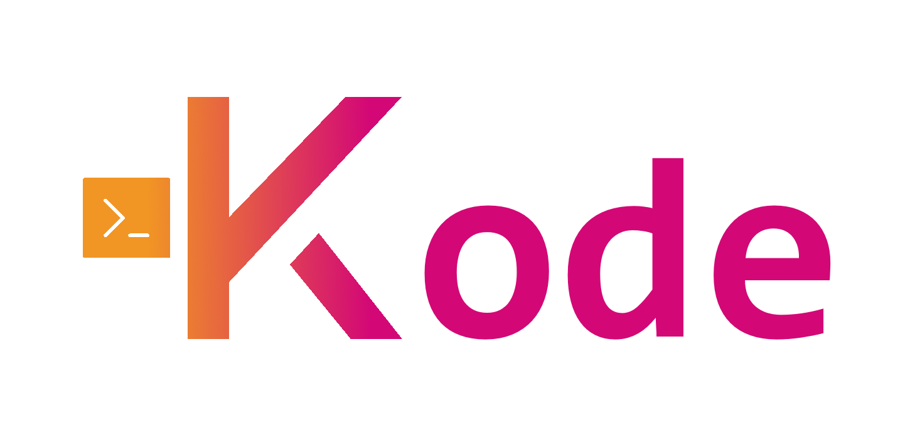

## Description
---
Kode is a dynamic and lightweight programming language.

## Installation
---

### Windows
1) Clone the repository.
2) Install Go from this [link](https://go.dev/).
3) Build and compile the project in the CLI using the custom script provided.
```cmd
cd Kode/
build.bat
```
4) Navigate inside the distribution directory to find the executable.
```cmd
cd dist/
```
5) (Optional) Add the executable `kode.exe` to the environment path as explained [here](https://www.architectryan.com/2018/03/17/add-to-the-path-on-windows-10/).
6) Run applications in the CLI using `kode -run <path to the application>`.

### macOS
*Coming soon...*

### Linux
*Coming soon...*